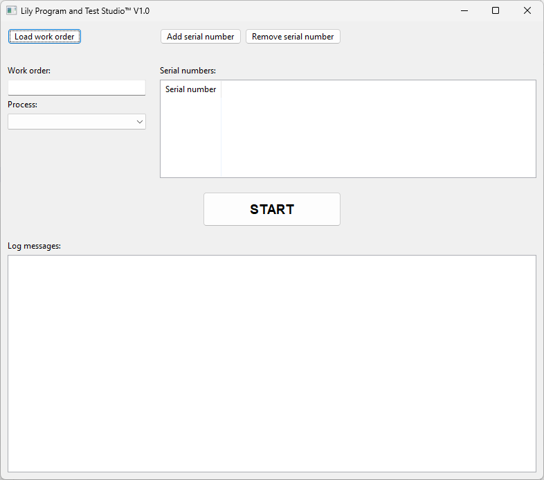

# Lily Program and Test Studio

Framework for automatic programming and testing electronic devices for manufacturing / production environments.

* Automated batch programming and testing
* Manual programming and testing optional
* Sequential or parallel programming and testing
* Extensive reporting
* Fully customizable processes using Python

